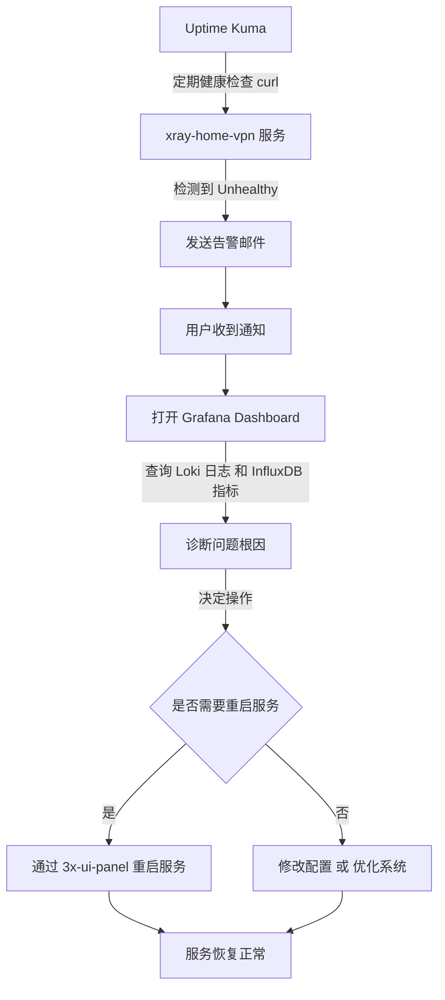
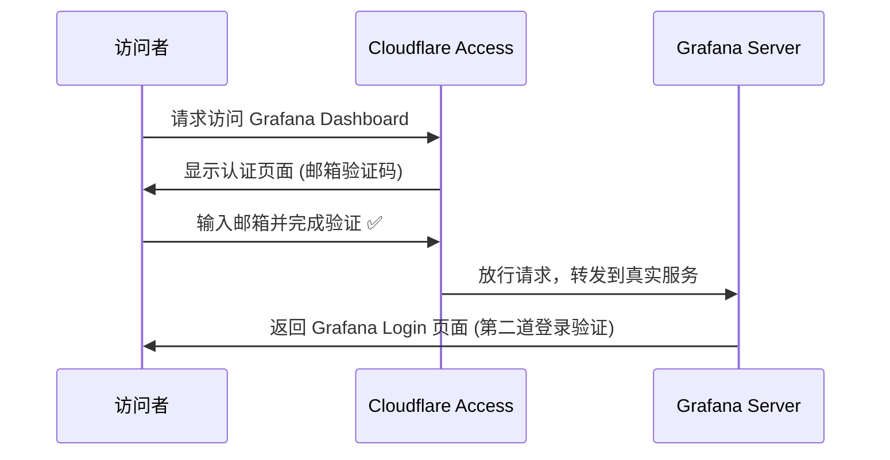

# 架构图
首先来看看我的家用服务架构图吧！  

## 监控
把监控放在前面讲是因为许多人在部署家用服务的时候往往会忽略这一块，很多时候只是想立马运行一个服务然后立即就能使用，没有考虑对服务的健康状态持续监控，这会导致偶发的服务断连并未被察觉，进而在未来发展成更大的系统性问题。

下面我会详细描述Grafana和Uptime kuma的职能。

我可以通过Grafana查询influxdb和loki中的系统状态，系统日志实现可视化的监控和诊断，同时我也能通过Uptime kuma监控所有服务的健康状态。

一个具体的案例是当我的xray-home-vpn服务down了后，Uptime kuma通过curl发现该服务unhealthy，遂通过邮件告知我xray-home-vpn service may down。这个时候我可以通过Grafana面板查询xray-home-vpn相关的系统日志从而诊断根本原因。（这一系列的操作都未涉及ssh到服务器的指令操作。）当我诊断出root cause后我可以决定是否通过3x-ui-panel重启该服务，或者进行其他后续的操作，例如修改配置等等。（此处可能涉及ssh到服务器后的指令操作）

---

## 安全
没有绝对的网络安全，如果有专业的黑客企图窃取我们的信息，那么总能找到一个突破口。此处我提供大众都在使用的一些安全策略。首先是登陆验证，所有对外映射服务的访问都必须经过登陆验证，这一点上诸如Nextcloud，3x-ui-panel，Pihole-panel，Grafana-dashboard，Uptime-kuma-dashboard都已自带，直接启用即可。除此之外我还推荐使用Cloudflare提供的Access Protection，通过简易的配置你就能在别人访问你服务前增加一道认证。只有通过Cloudflare认证的请求才会被redirect到你真正服务的入口处。

当我启用grafana的Access Protection的时候，一个具体案例是当我在公网试图访问Grafana dashboard的时候我会先访问Cloudflare提供的认证页面例如通过我的邮箱接收验证码，如果访问者并未被加入白名单，那么即便访问者输入了自己的邮箱也无法接收到验证码。当我接收到Cloudflare发送的验证码完成验证后，我会被redirect到grafana的login入口，这是第二道防线也就是我之前提到的常规登陆验证。

---

## 域名
推荐购买自己的域名，这样可以更灵活的部署自己的应用到公网，同时也方便自己记忆。 最方便的方式是通过Cloudflare购买域名，使用Cloudflare的DNS服务解析域名，使用Cloudflare的隧道技术安全的映射自己的服务到公网。（感谢Cloudflare大善人🙏）

---

## 服务器
这里会讨论到系统选择以及物理机选择。

树莓派的性能对于常规家用已经过剩，如果你的经费紧缺建议无脑入树莓派，需要注意的是我推荐你使用SSD作为树莓派的系统盘而不是Micro sd card。这对于你服务器稳定性的提升是质变的。考虑到稳定性和低功耗以及你想部署诸如Nextcloud这类的稍大型点儿的服务的话，我建议你购入Mac Mini。（此处为什么没有选择一体机的NAS，是因为自己喜欢从零开始折腾，不喜欢开箱即用。我更享受自己裸机部署各种服务的过程，同时可定制性也更高一些。）

系统的话推荐Ubuntu LTS版本，也可根据你自己偏好选择。如果考虑到轻量和极致性能的话可以使用Raspberry Pi OS。使用体验上和Ubuntu并无差别。

---

## 服务
这里会讲几个比较有趣的服务例如Nextcloud和Pi-hole。
剩下的诸如状态采集，日志收集的服务你可以根据你的偏好自行选择。

### Nextcloud & Pi-hole 简要介绍

| 服务名 | 功能简介 | 特点 |
|:--------|:----------|:------|
| **Nextcloud** | 私有云存储与协作平台，可替代 Google Drive、Dropbox 等 | 支持文件同步、在线文档编辑、共享日历和通讯录，插件生态丰富，可高度扩展 |
| **Pi-hole** | 网络级广告与追踪拦截器 | 在局域网层面屏蔽广告与恶意域名，提供详细的 DNS 统计和黑名单管理，可作为全家网络的“净化网关” |

Pi-hole可以定义局域网内的域名解析配合你的家用vpn有很多的玩儿法，这个不赘述可自行探索。

---

## 存储
最后讲到存储的原因是，对于一个稳健的服务器，毋庸置疑你需要一个硬盘柜并且允许容错性，那么Raid10也许是你的最佳选择。如果你的经费充足，你还能组建其他的磁盘阵列以保证你数据的可靠性。此处我选择自己购买的yottamaster的硬盘柜（无硬Raid版本）通过使用OWC softraid组建的软Raid，这样即便我的硬盘柜或者硬盘本身坏了，我都能通过软Raid替换损坏部件直接恢复数据。

---

## 花费
以上提到的所有服务和硬件除了域名和OWC softraid和你的家用物理机需要自己付费外均免费。

# 警告⚠️
请勿利用以上技术从事任何违法犯罪行为。
